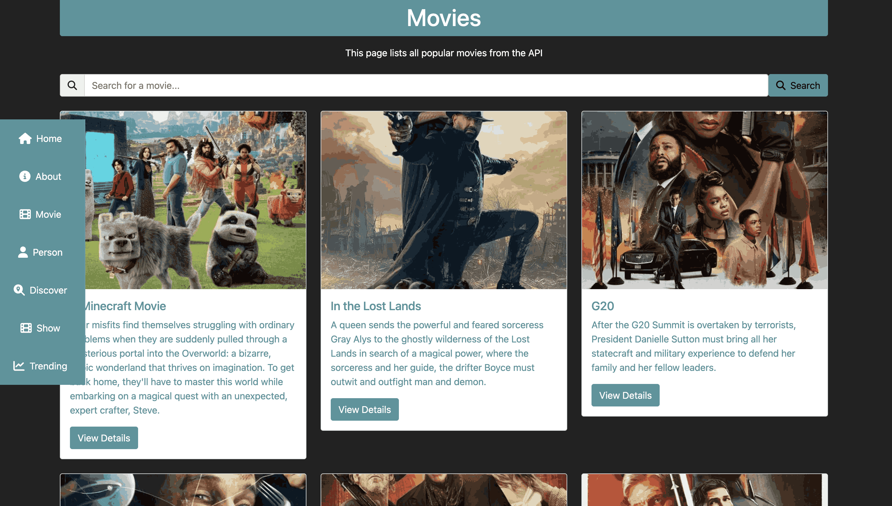
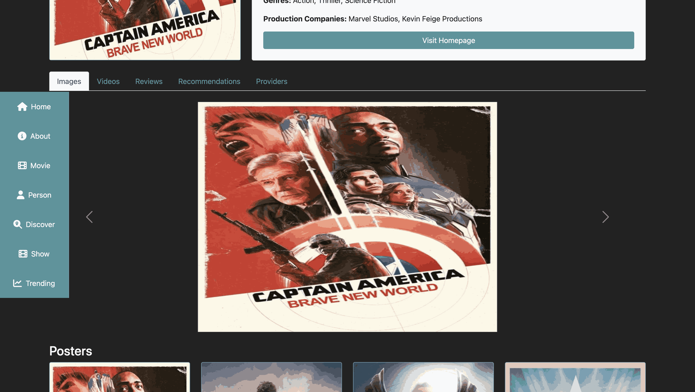
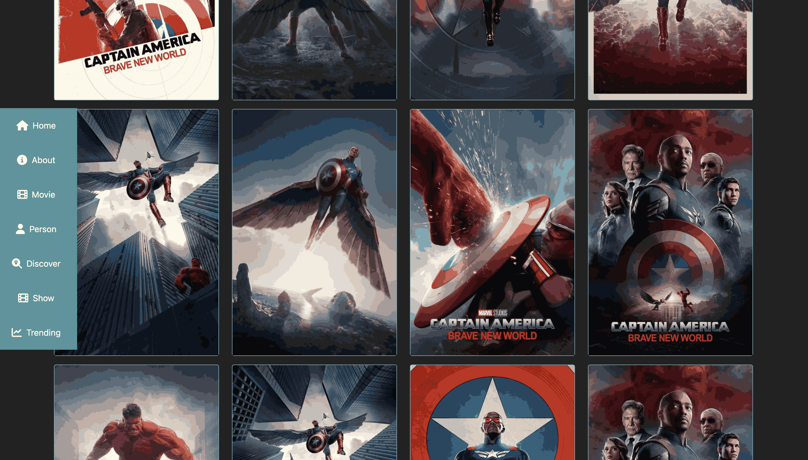
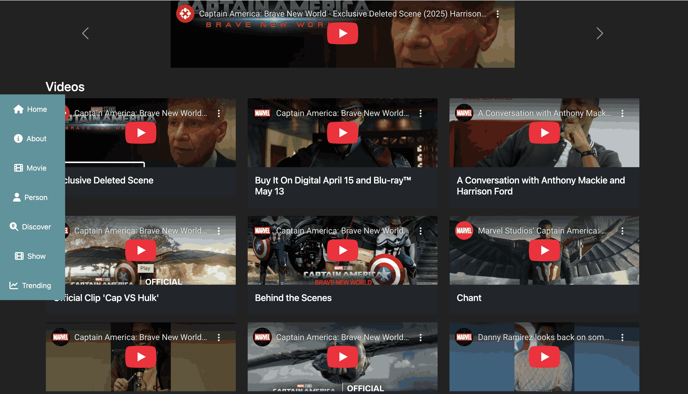
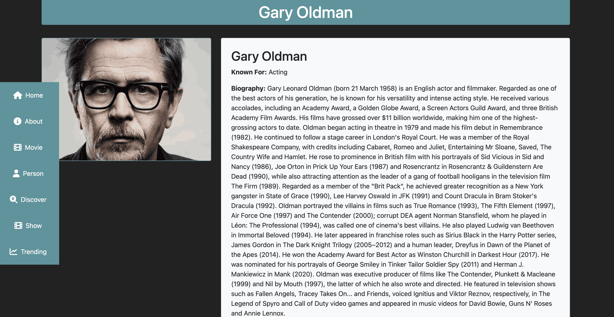
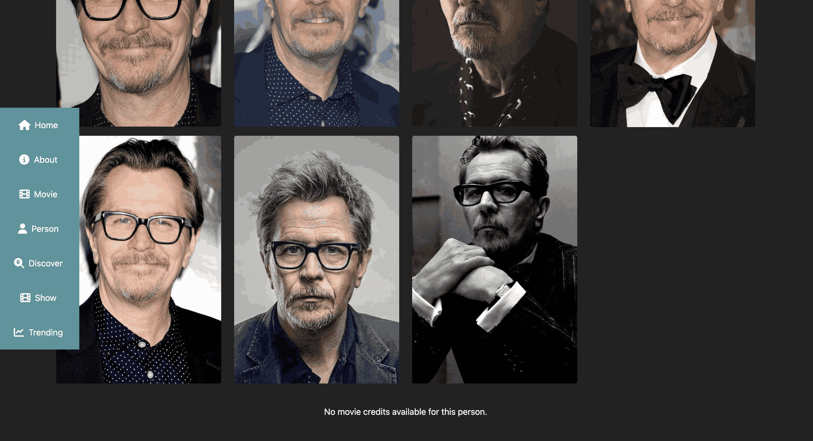

# TMDB Movies App - Vue JS and Bootstrap ⚡️


## Project Briefing

This application is a modern and responsive web app built using Vue.js and Bootstrap. It leverages the power of Vue's reactive framework and Bootstrap's sleek design system to deliver a seamless user experience. The app integrates with the TMDB API to fetch and display the latest movies, trending shows and people users. It also includes feature to search for your favorite movies, TV shows and stars associated with those assignments. With Vue Router for navigation and Pinia for state management, the application ensures smooth transitions and efficient data handling. The use of Vite as the build tool ensures fast development and optimized production builds. This project demonstrates the versatility of Vue and Bootstrap in creating dynamic and visually appealing web applications.


Made with ❤️ by **[@apfirebolt](https://github.com/Apfirebolt/)**

## Screenshots

Please find some of the screenshots below









## Features

- Search for movies, TV shows, and people.
- View trending movies, TV shows, and celebrities.
- Detailed information about movies, including cast, crew, and reviews.
- Get recommendations for movies and shows you already watched.
- Responsive design for seamless experience across devices.
- Smooth navigation with Vue Router.
- State management with Pinia for efficient data handling.
- Fast and optimized builds using Vite.
- Integration with TMDB API for real-time data.
- User-friendly interface with Bootstrap UI.
- Dynamic search functionality with instant results.
- Explore popular and top-rated content effortlessly.
- Bookmark favorite movies and shows for quick access.
- Multi-language support for a global audience.
- Dark mode for better viewing experience.
- Error handling and loading indicators for better usability.
- Continuous updates with the latest features and improvements.

## Updates 

- May 2025 : AG Grid added for Movie details page to show similar movies in tabular format.

## Built With

* [Vue 3](https://vuejs.org//)
* [Bootstrap](https://getbootstrap.com/)
* [Pinia](https://pinia.vuejs.org/)

## Project setup

Make sure you get your API key from 

[The Movie Database (TMDB) API](https://www.themoviedb.org/documentation/api)

Then create a .env file inside your main project folder with following contents

```
VITE_APP_KEY=Your_key_here
```

As next steps, just install node modules for the app and run the dev script.

```
npm install
npm run dev
```

For production, run the build npm command and serve the static files through a production or development server.

```
npm run build
npm start
```

### Custom Bootstrap Theme

This project uses a custom Bootstrap theme which is located in the assets folder but not include in Git repository. You can built custom themes by downloading bootstrap and changing the scss variables. Then, again build it and use the bootstrap and js min files.

```
:root {
  --bs-blue: #0d6efd;
  --bs-indigo: #6610f2;
  --bs-purple: #6f42c1;
  --bs-pink: #d63384;
  --bs-red: #dc3545;
  --bs-orange: #fd7e14;
  --bs-yellow: #ffc107;
  --bs-green: #198754;
  --bs-teal: #20c997;
  --bs-cyan: #0dcaf0;
  --bs-white: #fff;
  --bs-gray: #6c757d;
  --bs-gray-dark: #343a40;
  --bs-primary: #4f959d;
  --bs-secondary: #222222;
  --bs-success: #4d55cc;
  --bs-info: #7ac6d2;
  --bs-warning: #f5c45e;
  --bs-danger: #ac1754;
  --bs-light: #f8f9fa;
  --bs-dark: #212529;
  --bs-font-sans-serif: system-ui, -apple-system, "Segoe UI", Roboto,
    "Helvetica Neue", Arial, "Noto Sans", "Liberation Sans", sans-serif,
    "Apple Color Emoji", "Segoe UI Emoji", "Segoe UI Symbol", "Noto Color Emoji";
  --bs-font-monospace: SFMono-Regular, Menlo, Monaco, Consolas,
    "Liberation Mono", "Courier New", monospace;
  --bs-gradient: linear-gradient(
    180deg,
    rgba(255, 255, 255, 0.15),
    rgba(255, 255, 255, 0)
  );
}
```

Simply change these colors for your bootstrap file inside node modules, it should work as well.

## To Do

- Applying pagination to news and search news by keyword page.
- Docker deployment script with nginx. 
- Advanced Filtering
